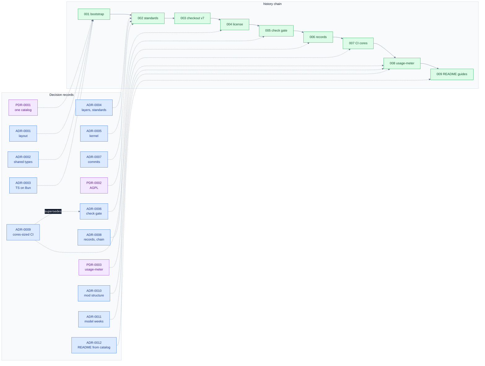

# Index

## Chains

| Chain | What it records | Nodes | Head |
|---|---|---|---|
| [history](chains/history/) | verified milestones of the repository | 9 | [history/009](chains/history/2026-10-05T0525--009--readme-install-guides.md) |

## history

| Node | Datetime (+06:00) | Milestone | Records | Commits |
|---|---|---|---|---|
| [001](chains/history/2026-10-05T0327--001--repository-bootstrap.md) | 2026-10-05 03:27 | Repository bootstrap | PDR-0001, ADR-0001, ADR-0002, ADR-0003 | 9c48b55 |
| [002](chains/history/2026-10-05T0339--002--standards-landed.md) | 2026-10-05 03:39 | Production standards landed | ADR-0004, ADR-0005, ADR-0007 | a01f9b2 45d482a d0ac0fc 9490514 |
| [003](chains/history/2026-10-05T0340--003--ci-checkout-v7.md) | 2026-10-05 03:40 | CI on actions/checkout v7 | | b3dda08 |
| [004](chains/history/2026-10-05T0342--004--license-agpl.md) | 2026-10-05 03:42 | License: AGPL-3.0-only | PDR-0002 | 8c94993 |
| [005](chains/history/2026-10-05T0346--005--check-gate.md) | 2026-10-05 03:46 | Heavy checks behind a machine gate | ADR-0006 | 5ca25a0 |
| [006](chains/history/2026-10-05T0357--006--decision-records.md) | 2026-10-05 03:57 | Decision records and the history chain | ADR-0008 | fc64229 |
| [007](chains/history/2026-10-05T0408--007--check-concurrency-auto.md) | 2026-10-05 04:08 | CI check concurrency from the host's cores | ADR-0009 | c8c04dc |
| [008](chains/history/2026-10-05T0445--008--usage-meter.md) | 2026-10-05 04:45 | The first mod: usage-meter | PDR-0003, ADR-0010, ADR-0011 | 11c48eb 6a1c90f f069555 eaf0a21 |
| [009](chains/history/2026-10-05T0525--009--readme-install-guides.md) | 2026-10-05 05:25 | Install guides in the README, rendered from the catalog | ADR-0012 | ebe95f4 |

## Graph

Green nodes are milestones in time order, joined by solid arrows; blue are architecture
decisions and purple product decisions, each joined by a dashed arrow to the milestone that
realised it; a dashed arrow labelled "supersedes" joins a record to the one it replaces.
